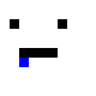

# gridpaint
A canvas for creating grid-based art in the browser. gridpaint supports dynamic
colour palettes and various tools such as bucket fill and undo.

[](http://requirebin.com/?gist=misterhat/518814835148aa20a3e3c0aa6acd2d39)

*Click the image above to test a demonstration!*

## Installation

    $ npm install --save gridpaint

### examples/browser.js
```javascript
var GridPaint = require('gridpaint');

var painter = new GridPaint({ width: 26, height: 15, cellWidth: 16 }),
    d, actions, f, t, b;

document.body.appendChild(painter.dom);
d = document.createElement('div');
d.style.marginBottom = '6px';

painter.palette.forEach(function (colour, i) {
    var b = document.createElement('button');
    b.style.backgroundColor = colour;
    b.style.border = '1px solid #000';
    b.style.marginRight = '4px';
    b.style.color = 'white';
    b.innerText = '\xa0';
    b.title = 'switch to ' + colour;
    b.onclick = function () {
        painter.colour = i;
    };
    d.appendChild(b);
});

document.body.appendChild(d);
d = document.createElement('div');

actions = [ 'pencil', 'bucket', 'undo', 'redo', 'clear', 'saveAs' ];
actions.forEach(function (action, i) {
    var b = document.createElement('button');
    b.innerText = action;
    b.onclick = function () {
        if (i < 2) {
            painter.tool = action;
        } else {
            painter[action]();
        }
    };
    d.appendChild(b);
});

document.body.appendChild(d);

d = document.createElement('div');
f = document.createElement('select');
t = document.createElement('select');
b = document.createElement('button');

b.innerText = 'replace';
b.onclick = function () {
    var selects = document.getElementsByTagName('select');
    painter.replace(selects[0].value, selects[1].value);
};

painter.palette.forEach(function (c) {
    var oF = new Option(c),
        oT = new Option(c);

    oF.style.backgroundColor = c;
    oT.style.backgroundColor = c;
    f.appendChild(oF);
    t.appendChild(oT);
});

d.appendChild(f);
d.appendChild(t);
d.appendChild(b);
document.body.appendChild(d);

painter.init();
```

    $ npm run build-example
    $ sensible-browser example.html

### examples/node.js
```javascript
var GridPaint = require('gridpaint');

var painter = new GridPaint({ width: 10, height: 10, cellWidth: 16 }),
    strokes = [
        { x: 1, y: 1 },
        { x: 2, y: 1 },
        { x: 2, y: 2 },
        { colour: 4, x: 1, y: 2 },
        { x: 5, y: 1 },
        { x: 5, y: 2 },
        { x: 6, y: 1 },
        { colour: 4, x: 6, y: 2 },
        { colour: 4, x: 2, y: 5 },
        { colour: 4, x: 3, y: 5 },
        { colour: 4, x: 4, y: 5 },
        { colour: 4, x: 5, y: 5 },
        { colour: 13, x: 2, y: 6 }
    ];

painter.tool = 'pencil';

strokes.forEach(function (a) {
    painter.colour = a.colour || 1;
    painter.cursor.x = a.x;
    painter.cursor.y = a.y;
    painter.action();
});

painter.saveAs('node.png');
```

    $ node examples/node



## Properties
All of these properties can be adjusted on the fly and will be applied next
animation frame.

```javascript
painter.width = 16; // painter width (in cells)
painter.height = painter.width; // painter height (in cells)
painter.cellWidth = 16; // the width of each cell
painter.cellHeight = painter.cellWidth; // the height of each cell

painter.background = true; // draw the checkered transparent background
painter.colour = 0; // the currently selected colour
painter.cursor = { x: -1, y: -1 }; // crosshair location
painter.grid = false; // display a contrasted grid over the image
painter.isApplied = false; // the status of mousedown
// colours the image will contain
painter.palette =  [ 'transparent', '#fff', '#c0c0c0', '#808080', '#000',
                     '#f00', '#800', '#ff0', '#808000', '#0f0', '#080', '#0ff',
                     '#008080', '#00f', '#000080', '#f0f', '#800080' ]
// a 2D array painter.height x painter.width of palette indexes
painter.painting = [ [], ... ];
painter.tool = 'pencil'; // the currently selected tool (pencil or bucket)

// stacks of deep-diff changes
painter.undoHistory = [];
painter.redoHistory = [];

// whether or not the draw loop is activated (activated after init() is called)
painter.drawing = true;

painter.dom = HTMLCanvasElement; // the DOM element to append to the document
```

## API
### new GridPaint(options)
Create a new `painter` instance.

`options` is an optional object that can contain the following properties (see
above property definitions for defaults): `{ width, height, cellWidth,
cellHeight, palette }`.

### painter.action()
Apply the current tool to the canvas.

### painter.applyTool([isApplied])
Apply (or unapply) whichever tool is selected to the canvas in the cursor's
current position.

`isApplied` is a `Boolean` value. If not provided, `isApplied` is toggled
instead.

### painter.bucket([replace, x, y])
Fill in surrounding, like-coloured cells.

`replace` is the colour index to replace. If not provided, the colour under `x`
and `y` is used.

`x` and `y` are the coordinates to begin the replacement process. If not
provided, `cursor` position is used.

### painter.clear()
Set all of the cells to the first colour in the palette.

### painter.destroy()
Remove event handlers and cease the draw loop (browser only).

### painter.init()
Initialize event handlers and start the draw loop (browser only).

### painter.pencil()
Set the cell in cursor's position to the selected colour.

### painter.redo()
Redo the last undo action.

### painter.replace(old, replace)
Replace `old` colour with `replace` colour`.

Both arguments can be either the position of a colour on the palette, or a
string of the colour to be `indexOf`'d.

### painter.resize()
Set the painter's <canvas> element to the proper size. Call this if `width`,
`height`, `cellWidth` or `cellHeight` are adjusted.

### painter.saveAs([file, scale])
Export the painting as a PNG file.

`file` is the default filename to save to. Default: `"painting.png"`.

`scale` is a Number that describes what scale to resize the saved canvas (`0.5`
will be half the original, `2` would be twice as large). Default: `1`.

### painter.undo()
Undo the last action since the last tool was applied.

## Events
Events share the same names as the methods that trigger them. The following
methods trigger events:

```javascript
[
    'action',
    'applyTool',
    'clear',
    'move',
    'redo',
    'replace',
    'undo'
]
```

## License
Copyright (C) 2016 Mister Hat

This library is free software; you can redistribute it and/or modify it under
the terms of the GNU Lesser General Public License as published by the Free
Software Foundation; either version 3.0 of the License, or (at your option) any
later version.

This library is distributed in the hope that it will be useful, but WITHOUT ANY
WARRANTY; without even the implied warranty of MERCHANTABILITY or FITNESS FOR A
PARTICULAR PURPOSE.  See the GNU Lesser General Public License for more details.
